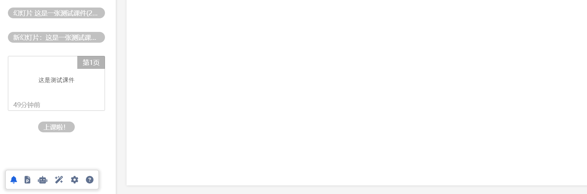
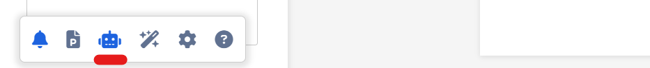
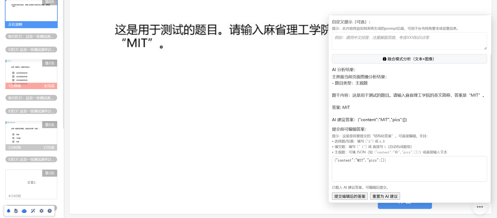
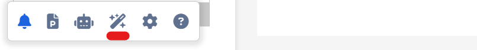
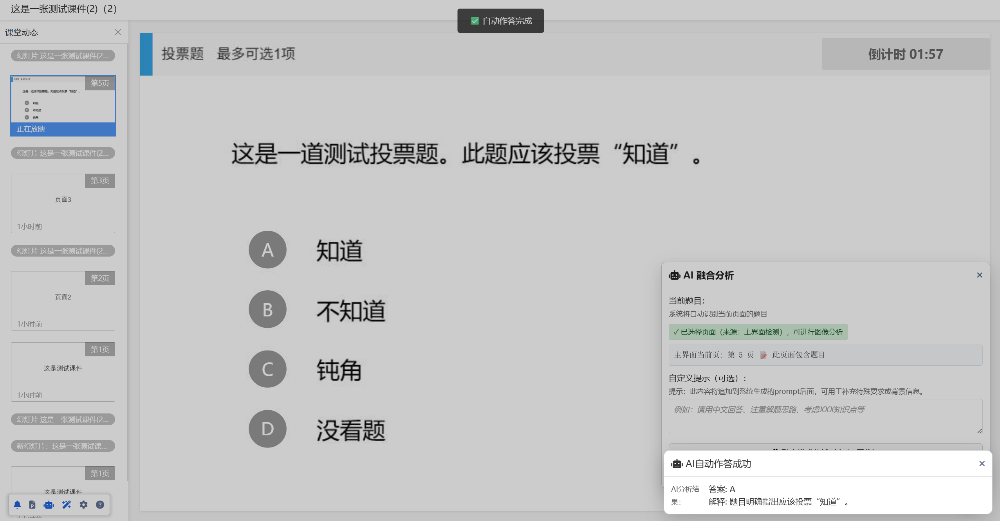
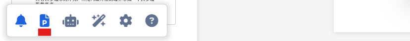
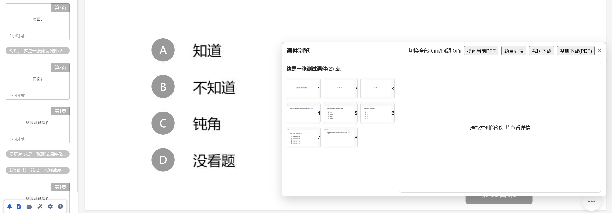

<p align="center">
  <a href="https://github.com/ZaytsevZY/yuketang-helper-auto/pulls">
    
  </a>
  <a href="https://github.com/ZaytsevZY/yuketang-helper-auto/blob/main/LICENSE">
    
  </a>
</a>


<html>
    <h1 align="center">
      yuketang-helper-auto 
    </h1>
    <h2 align="center">
       雨课堂通用辅助工具
    </h2>
    <h3 align="center">
       适用于雨课堂/荷塘雨课堂
    </h3>
</html>

> 最后更新时间：2025.10.28

## 项目说明

- 项目灵感来自于：[雨课堂助手](https://github.com/hotwords123/yuketang-helper.git)，本项目已兼容ykt-helper v1.5.1。

- 项目兼容：[清华大学荷塘雨课堂助手-AI版](https://github.com/DragonAura/THU-Yuketang-Helper-AI)，但是不建议同时使用2种AI答题。

- 注意：本项目暂时不支持雨课堂最新版的**动态二维码**，如果你修读的课程使用动态二维码，我们无法提供摸鱼方面的帮助。


## 安装方法

- 本工具基于npm构建，可以在chrome浏览器或edge浏览器上配合篡改猴(Tampermonkey)插件使用；

- 首先确保浏览器已安装[篡改猴(Tampermonkey)](https://www.tampermonkey.net/)插件；

  - 如果你使用的浏览器是edge，你需要打开拓展-管理拓展-开发者模式

- 在安装对应插件后，可以[一键安装](https://update.greasyfork.org/scripts/531469/AI%E9%9B%A8%E8%AF%BE%E5%A0%82%E5%8A%A9%E6%89%8B.user.js)本项目的**稳定版本**；(一般不是最新版)

- 或手动创建新脚本，复制```yuketang-helper-ai-<版本号>.js```到篡改猴新建脚本中。

- 目前支持141.0.7390.108-chrome及以下的chrome版本，你可以在141.0.3537.99-edge及以下的edge版本上进行测试。

## 源代码

- 我们重构的代码放在`../ykt-helper/src`文件夹中，建议在此处加入新功能或进行修改；

- 关于代码的开发和组装方法，请参考[脚本的开发和npm组装](./ykt-helper/readme.md)。

## 功能介绍

加载成功时，进入课堂后页面左下角会出现一个工具栏。



### 1. 课堂习题提示

- 继承原版脚本的上课/下课/习题提示，防止上课摸鱼错过习题。（需要打开浏览器）

- 若要查看这堂课的所有习题信息，可以点击工具栏的「查看课件和幻灯片」图标。

- 可以在 :gear: 中修改习题提醒的方式。


### 2. AI解答功能



- 使用kimi k2模型智能解答课堂习题，需要**自行设置密钥**
- 支持所有题型，包括单选，多选，填空，简答，投票
- 点击工具栏的「AI解答当前习题」 :robot: 即可解答
- 如果你没有摸鱼，在作答结束之前你将能够修改AI作答的结果
- 注意：对于**没有公布题干**的题目（当堂出题），请不要使用AI作答




### 3. 自动作答习题



- 可以在设置 :gear: 界面设置是否自动作答，以及自动作答的延迟时间
- 自动作答支持所有题型，包括单选，多选，填空，简答，投票
- 自动作答成功后，建议手动刷新一次界面，纯挂机后果自负
- 自动作答可能有误，可能作答失败。本插件不对可能造成的成绩影响负责
- 在没有配置Apikey而且全程挂机的情况下，本插件将随机作答



### 4. 课件/习题列表界面



- 点击工具栏的「查看课件和幻灯片」 :receipt: 图标可以打开课件浏览窗口
- 支持对幻灯片进行单页下载和PDF格式导出
- 兼容原版的<u>查看习题列表，手动提交和补交习题</u>
- 可以浏览当前课程的所有幻灯片内容及所有习题内容
- 支持对不懂的幻灯片进行提问（需要接入AI，暂时支持单页PPT提问）



### 5. 自动进入课堂（测试中）

- 登录后进入雨课堂主页

- 在设置中打开“自动进入课堂”，刷新页面

- 在开始上课后会自动进入正在上课的页面

## 使用方式

### 1. 工具栏说明

- 页面左下角会出现工具栏，包含以下功能按钮：
  - 习题提醒（ :bell: ）：切换是否在新习题出现时显示通知
  - 课件浏览（ :receipt: ）：进行课件操作，查看习题列表
  - AI解答（ :robot: ）：使用AI解答当前习题
  - 自动答题（ :magic_wand: ）：自动答题
  - 设置（ :gear: ）：设置脚本行为和API密钥
  - 使用教程（ :question: ）：显示详细使用说明

### 2. 设置AI功能

- 点击设置按钮（ :gear: ）
- 输入你的Kimi API密钥（需要自行申请）
- 设置完成后即可使用AI解答功能

### 3. AI解答使用方法

- 在课堂页面点击AI解答按钮（ :robot: ）
- 如果未打开问题列表，会默认解答最新的题目（你可以在:gear:中调整）
- 如果已打开问题列表并选择了某个问题，会解答选中的问题
- 目前暂时不支持从左侧边栏中选择要回答的问题

### 4. 课件浏览

- 点击文件图标（ :receipt: ）打开课件浏览面板
- 可以查看所有幻灯片，默认只显示习题页面
- 点击"切换全部页面/问题页面"可以显示全部幻灯片
- 点击课件标题旁的下载按钮可以导出为PDF
- 点击"习题列表"以查看需要提交或者补交的习题

## 注意事项

- 本工具仅供学习参考，建议独立思考解决问题
- AI解答功能需要使用Kimi API，可能会产生API使用费用
- 本项目不会线上存储用户的任何个人信息，只会将相关的题目信息上传给LLM

## 更新记录

请在[更新记录](./changelog.md)中查看详细的更新记录。

---

- 1.19.1: 增加了markdown渲染器

- 1.19.0: 新增了自定义习题提醒，修复了若干bug

- 1.18.7: 增加自动进入课堂功能

- 1.18.6: 修改提示词

- 1.18.5: 增加了无AI环境的随机答题模式，增加了修改AI答案

- 1.18.4: 优化提问逻辑，兼容原版1.5.1

- 1.18.3: 优化了ui，弹窗自动消失

- 1.18.1: 题目图片改为了ppt，而不是截图

- 1.18.0: 所有询问均改成了视觉+文本的询问

- 1.17.0: 加入了kimi vision模型，更好的识别课件内容

- 1.16.8: 将模型改为kimi

- 1.16.6: 优化了课件呈现，修复了之前的一些bug

- 1.16.4: 优化了课件呈现，只会呈现本课程的课件了

- 1.16.0: 加入了大模型回答后弹窗，以及弹窗自动关闭

- 1.15.0: 加入了大模型答案的模糊匹配，关闭了自动刷新页面

- 1.14.0: 优化了自动作答的开启关闭的逻辑，加入了自动刷新页面

- 1.13.0: 加入了自动作答

- 1.12.0: 可以实现ai作答

---

## 附录1 Kimi API 申请方法

1. 访问[月之暗面开放平台](https://platform.moonshot.cn/)，进行注册登录
2. 点击左侧API keys一栏，点击创建API key，命名后会生成一串以sk开头的随机字符，就是key。保管好这个key，你可以将他复制到本地安全的地方。这个key不能再次生成或查看！如果丢了，需要重新生成新的key。（生成key不需要任何花费）
3. 充值任意金额后，这个key就可以使用了。你可以将key设置到本项目中进行使用，或使用其他方式调用。
