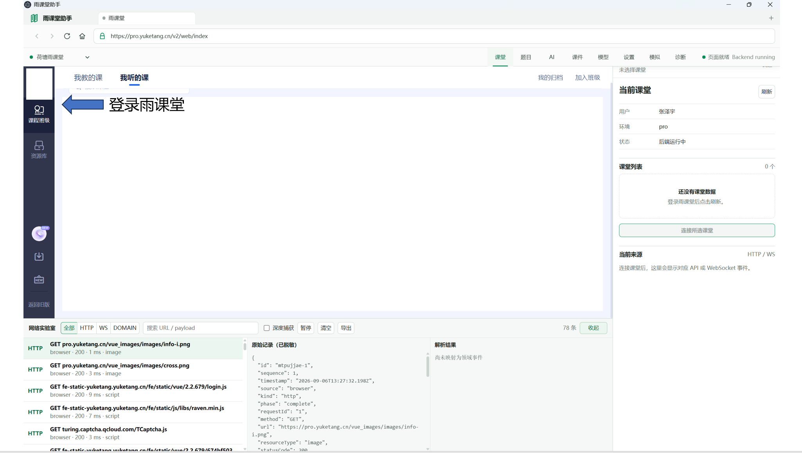
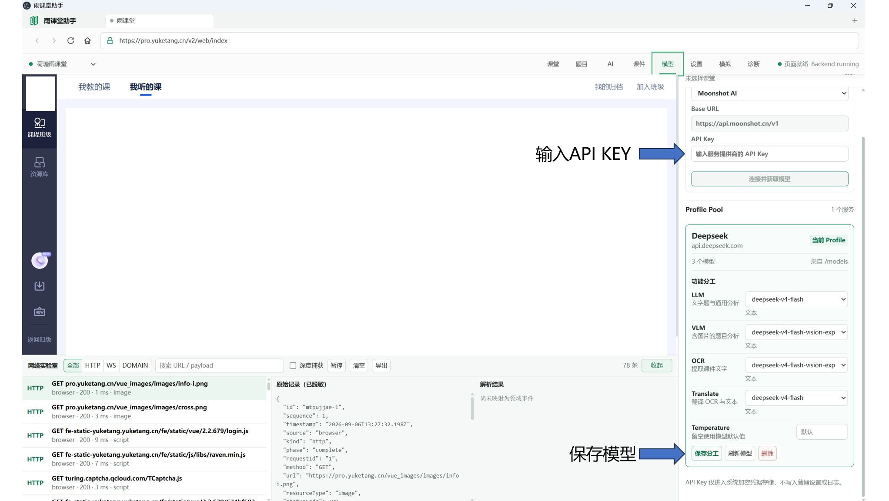
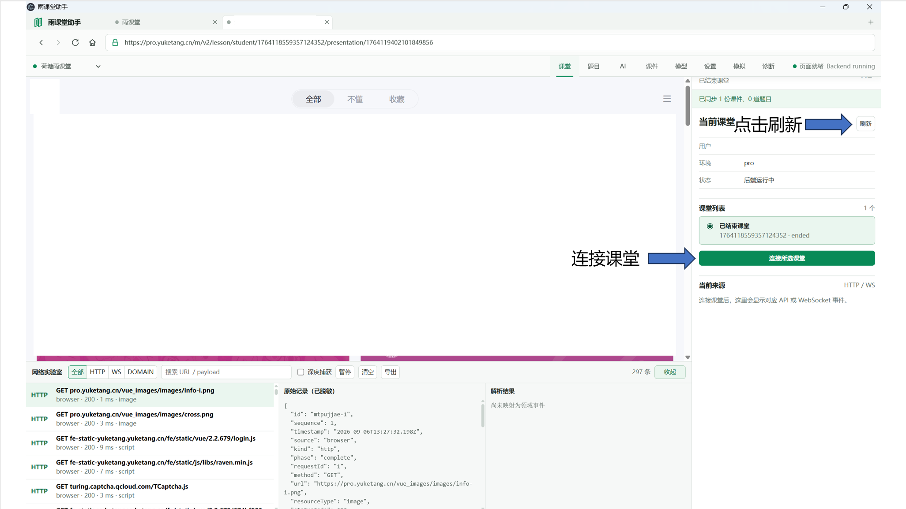
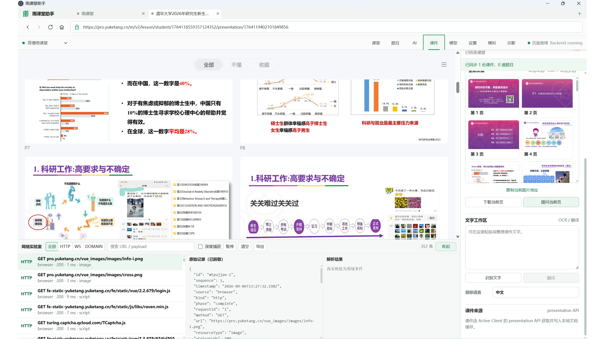

<p align="center">
  <a href="https://github.com/ZaytsevZY/yuketang-helper-auto/pulls">
    
  </a>
  <a href="https://github.com/ZaytsevZY/yuketang-helper-auto/blob/main/LICENSE">
    
  </a>
  <a href="manifest.json">
    
  </a>
  <a href="#">
    
  </a>
</a>


<html>
    <h1 align="center">
       雨课堂助手
    </h1>
    <h3 align="center">
       Yuketang Helper AI
    </h3>
</html>


[返回旧版](./README_origin.md)

## 简介

> Latest Release：2.0.0-preview 20260906

[雨课堂助手](https://github.com/hotwords123/yuketang-helper.git)的最新修改版本，为您的雨课堂学习提供各类模型服务。在阅读[证书](LICENSE)（MIT LICENSE）后，你可以自由对本项目进行使用或开发。

- 本项目仅供学习参考，建议独立思考解决问题

- 本项目可能会产生API使用费用，请注意消费

- 本项目不会线上存储用户的任何个人信息或其他敏感信息

## Quick Start

- 安装 [Node.js](https://nodejs.org/en) 24.x 和 npm 11.x。

```sh
git clone https://github.com/ZaytsevZY/yuketang-helper-auto.git
cd yuketang-helper-auto/ykt-helper-win
npm ci --include=dev --include=optional
npm run build
npm start
```

- 登录雨课堂



- 填入 API 并设置各功能的对应模型



- 连接需要 AI 辅助的课程



- 在其他页面选取 AI 辅助的功能



## 源代码

|文件夹|适用平台|状态|
|---|---|---|
|`ykt-helper`|Edge/Chrome 浏览器|`1.21.5` 正在更新|
|`ykt-helper-win`|Windows/macOS 独立客户端|`2.0.0-preview`正在更新|
|`ykt-helper-android`|Android 移动端|正在开发|

## 功能

1. **信息提醒** :bell: 
- 在发布新题目，考试开始，课程开始/结束等雨课堂事件发生事进行提醒
- 支持自定义提醒方式：弹窗，声音和通知
- 支持统计用户在雨课堂上的课程、作业和考试
- 支持自动进入正在上课的课堂

2. **查看课件和幻灯片** :receipt: 
- 支持在课程开始后提前查看课件/习题表，包括已经结束的课程
- 支持对课件进行批量化管理和PDF/图片格式下载
- 对课件进行了特殊缓存，能够缓解切换课件卡顿问题

3. **AI辅助学习** :robot: 
- 支持对课件内容进行文字识别、自定义语言翻译
- 支持对课件内容进行AI提问和多轮对话
- 支持对课堂习题内容进行提问和AI答题（有风险）
- 支持对作业和已结束的考试进行逐题AI解答
- 支持在一定时间内补交习题

4. **模拟和开发** :gear:
- 支持模拟 Chrome 浏览器行为
- 为开发者提供了模拟事件、网络实验室和诊断工具

## 雨课堂 CLI

如果你有多余 token，需要使用 Codex/Claude Code 或者其他 agent 访问本项目，我们建议使用 ykt-cli。

ykt-cli 目前支持的常用命令如下：

```
# 你可以让 agent 将 ykt-cli 命令简写为 ykt []

# 状态与设置
npm run cli -- status
npm run cli -- settings get
'{ "autoAnswer": true }' | npm run cli -- settings update --from -
npm run cli -- settings reset

# 用户、课堂、课件、题目
npm run cli -- user get --environment standard --refresh
npm run cli -- lesson list --environment all --refresh
npm run cli -- lesson connect <lesson-id> --environment standard
npm run cli -- presentation list --lesson <lesson-id>
npm run cli -- presentation export <presentation-id> --lesson <lesson-id> --out deck.pdf
npm run cli -- slide get <slide-id> --lesson <lesson-id>
npm run cli -- slide read <slide-id> --lesson <lesson-id>
npm run cli -- slide download <slide-id> --lesson <lesson-id> --out slide.png
npm run cli -- problem list --lesson <lesson-id>
npm run cli -- problem get <problem-id>

# AI Profile 与 AI 调用
npm run cli -- ai profile list
npm run cli -- ai profile connect --base-url https://ai.example.com --api-key -
npm run cli -- ai profile assign <profile-id> --model gpt --vision-model gpt-vision `
  --ocr-model ocr --translation-model translator --temperature null
npm run cli -- ai profile select <profile-id>
npm run cli -- ai profile refresh <profile-id>
npm run cli -- ai profile delete <profile-id>
npm run cli -- ai ask --prompt "解释这道题" --problem <problem-id>
"解释当前页面" | npm run cli -- ai ask --prompt - --capture-page
npm run cli -- ai translate --text "你好" --to English

# 嵌入浏览器、面板布局、网络实验室
npm run cli -- browser state
npm run cli -- browser environment pro
npm run cli -- browser open https://www.yuketang.cn/web
npm run cli -- browser back
npm run cli -- browser tab-new
npm run cli -- layout --assistant collapsed --network-lab expanded
npm run cli -- network snapshot
npm run cli -- network pause
npm run cli -- network deep-capture on
npm run cli -- network export --out fixture.json

# 课堂本地模拟
npm run cli -- simulate state
npm run cli -- simulate show-slide
npm run cli -- logs list --limit 50

# 在资源管理器中打开内置模块源码（与助手面板“源码”入口一致）
npm run cli -- source open backend
```

在源码构建版本中，推荐的使用方式形如：

```
npm run cli -- lesson list --environment all --refresh
npm run cli -- presentation list --lesson <lesson-id>
npm run cli -- slide read <slide-id> --lesson <lesson-id>
npm run cli -- answer propose <problem-id>
'["A"]' | npm run cli -- answer validate <problem-id> --from -
```

ykt-cli 是适用于 agent 的超轻量工具，我们欢迎在 ykt-cli 中实现新功能。

## 推荐项目

- 对于THU同学，我们推荐[OneTHU](https://github.com/smartThise/OneTHU)，本项目的大部分功能已经在该项目中内置；本项目可能对非荷塘雨课堂的其他服务器缺少支持，欢迎PR

- 项目灵感来自于：[雨课堂助手](https://github.com/hotwords123/yuketang-helper.git)，本项目兼容至`ykt-helper v1.5.1`。

- 项目兼容：[清华大学荷塘雨课堂助手-AI版](https://github.com/DragonAura/THU-Yuketang-Helper-AI)，但是不建议同时使用2种AI答题。

- 项目兼容：[雨课堂考试助手](https://github.com/soundstarrain/yuketang-assistant)，如果有考试测试需要，请移步该项目。我们不同意任何使用 LLM 的作弊行为。

---

## 附录1 API 申请方法

以Kimi API为例：

1. 访问[月之暗面开放平台](https://platform.moonshot.cn/)，进行注册登录
2. 点击左侧API keys一栏，点击创建API key，命名后会生成一串以sk开头的随机字符，就是key。保管好这个key，你可以将他复制到本地安全的地方。这个key不能再次生成或查看！如果丢了，需要重新生成新的key。（生成key不需要任何花费）
3. 充值任意金额后，这个key就可以使用了。你可以将key设置到本项目中进行使用，或使用其他方式调用。

目前支持大部分 OpenAI 协议模型，包括 GPT/Grok/DeepSeek/GLM/Kimi/MiniMax 等；不支持 Anthropic 协议的模型。

以下中转站也可以获取 API key：

|API提供商|url|购买KEY|
|---|---|---|
|硅基流动|https://api.siliconflow.cn/v1/chat/completions|[硅基流动](https://cloud.siliconflow.cn/me/models)|
|阿里云|https://dashscope.aliyuncs.com/compatible-mode/v1/chat/completions|[阿里云百炼](https://bailian.console.aliyun.com/)|
|并行科技|https://ai.paratera.com/v1/chat/completions|[清华](easycompute.cs.tsinghua.edu.cn/home) / [其他学校](https://ai.paratera.com/#/lms/api)|

可以在设置中管理所有 API key 和当前使用的 API key
